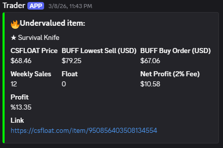

# CS2 Market Sniper

Automatically finds undervalued CS2 skins on CSFloat by comparing prices with Buff163, and sends instant Discord alerts when a profitable deal is detected.



---

## What It Does

The bot continuously scans the latest listings on CSFloat and checks the same item's price on Buff163. If the price difference is profitable enough, it sends a Discord notification with all the details — so you can buy before anyone else.

---

## What the Alert Includes

- CSFloat listing price
- Buff163 lowest sell price
- Buff163 buy order price
- Estimated net profit (after 2% fee)
- Weekly sales volume (liquidity check)
- Float value
- Direct link to the listing

---

## Filters

The bot skips items that don't meet the minimum criteria to avoid bad deals:

- Minimum discount: 5%
- Minimum profit: $2.00
- Minimum weekly sales: 10
- Stickers, Graffiti, Patches and Charms are ignored

All of these can be adjusted at the top of `main.py`.

---

## Setup

```bash
pip install aiohttp
```

Open `main.py` and fill in your credentials:

```python
API_KEY      = "your CSFloat API key"
WEBHOOK      = "your Discord webhook URL"
BUFF_COOKIE  = "your Buff163 cookie"
```

Then run:

```bash
python main.py
```

---

## Requirements

- Python 3.10+
- CSFloat API key
- Buff163 account cookie
- A Discord webhook
